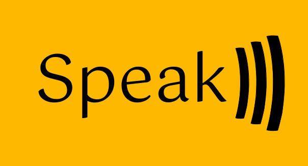

<h1 align="center">

Speak



</h1>

Speak is a **Chatbot based in machine-learning**, which can be used to **interact with the user**. The philosophy of the project is to **make the user feel like they are talking to a real person**, and the way Speak does that is by being very fast, that's it.

## Installation

Just put this in your `Cargo.toml`
```toml
speak = "0.1.11"
```

## Features
Speak is very simple to use by design, that's the reason it has only a few public objects and functions. The features you're going to use are:

- `DynMap` (Struct)
- `learn(...)`
- `run(...)`

**That's it**, you can use Speak with just two functions! These two functions are just normal functions, and you can use them in any way you want. If you want to know more, check your favorite IDE documentation tool. (All docs are integrated in the crate.)

## Configuration
One of the philosophies of Speak is that the UX is very customizable. That's why Speak has a lot of flexibility when using custom features, there isn't any limit to the number of custom features you can use, and you can enable or disable them at any time, without compromising any other configuration.

To see the features you can use and their configuration, check the Speak documentation, [clicking this](https://docs.rs/speak/latest/speak/)

See also: [Features Documentation](https://doc.rust-lang.org/cargo/reference/features.html)

## Why is Speak so fast?

Firstly, Speak is written in Rust, with just a few hundred lines of code, with 0 dependencies and just two files (the main library and the utils library.), Secondly, it's written in the (realisticly) most efficient and strict way possible. Also have in mind that Speak **is** designed to be fast in every loop, in every function wrapping there's a lot of thought, because **performance is very important for this project**, we want to be able to even have a **live chat** with the bot.

## Contributions

You can contribute to this project with almost anything, it can be code, documentation, bug reports, feature requests... etc. You can do it opening an [issue](https://github.com/SpeakML/speak/issues/new) or a [pull request](https://github.com/SpeakML/speak/pulls/new), or you can contact me on social media.

Currently there isn't any contributor guide *yet*, I'll make one soon.

**Thanks for contributing!**

<h1 align=center>

[](https://github.com/SpeakML/speak/stargazers)

</h1>

## ⚖️ License & Credits

Speak uses the [**Mozilla Public License, Version 2.0**](https://github.com/SpeakML/speak/blob/current/LICENSE/)

Creator: [Alex G. C. aka Blyxyas](https://github.com/blyxyas)
