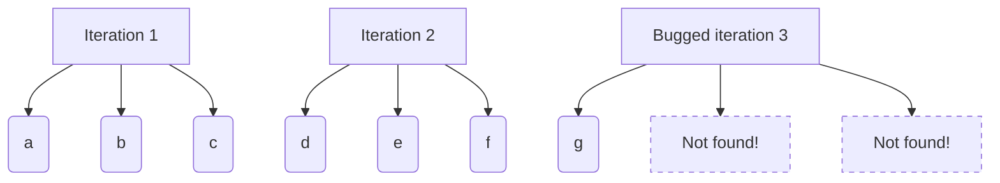
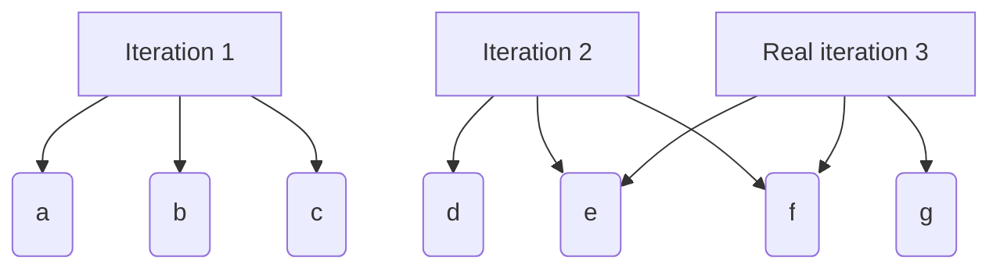

**Hey! This isn't an explanation that you need to know, just me talking about the project and all its features and algorithm.**

# How does it works? 🤔

The Speak algorithm is fairly simple, and that's why it's so powerful, yet easy to understand.
First, you need to understand that if  then , it's easy, right? Well, understanding that is the 40 percent of the algorithm.

, where  is the threshold that the users gives to the algorithm.

But, what are those generics? Well, they're *the sum of the chunks from the translated values.* What does that mean?

## Translation:

Words are bad, a word uses various characters, and those characters take up a lot of space, wouldn't it be nice if we could translate a whole world into a single integer?

When I say *"translation"* I don't mean changing a phrase between two language, I mean converting a word into a number.

If you're curious of how the `translate(...)` internal function works. It's pretty simple. Here it is, in Pseudo-code:

```pseudo-code
FOR word IN phrase:
	FOR character in word:
		sum += character AS integer

	list.push( sum ^ ( 3 / 2 ) )

RETURN list
```

This simple function gives us a list of integers, each one representing a whole word.

Being unsigned 16-bit integers, we save a lot of space doing this simple operation.

<small>(For efficiency reasons, the real function takes a list of phrases, not just one.)</small>

## Chunking:

A `Chunk` is a list of slices of a phrase. Each slice is a n-length group of words.

In Rust this is `Chunk: Ve<&[u16]>`.

Ok, let's say that we have a phrase like this:  and our memory is 3. We want to chunk that phrase into 3-length groups. So we'll have:



Mmmmm... That's not good, that's a bug, the size of the phrase, this happens because  (being  the memory size and  the phrase size). What's the solution to this catastrophe? Well, it's fairly simple, just add as the final iteration (In this case, the 3rd iteration) the slice between the end of the phrase - the memory size and the end of the phrase.



That's it, **all problems are fixed, forever**.

**Oh no! Another problem**

What would happen if the memory size was bigger than the number of words in the phrase? Well, in that case we would get a slice from a non-existent index.

That's why, before chunking anything, we check if the phrase is long enough to be chunked by the current memory size. If it is: great!, else we modify the memory size to be the length of the phrase.

**Ok, all is ready, but what do chunks do?**

As you know, every phrase is made up of syntactic units, each unit representing a meaning.

Some of the most common units are things like: *I have a ..., my name is ..., I am a ...*, etc.

These units have a meaning, well, those units are called *chunks* in the code.

## The algorithm

The first step is to find the relations between the chunks of the key and the value.

Dividing two numbers is finding the relation between the two, so we need to divide the total value of the two chunks to find their relation.
<h3 align="center"></h3>


Ok, now we have that relation, what do we do now?

Well, first of all, let's add all those relations together in a group named . That gives us:

<h3 align="center"></h3>


Ok, right now we have a group of relations, what do we do now? Was that useless?

**Now we can start using the information that I gave at the start!**

---

> First, you need to understand that if  then , it's easy, right?

With that, we now have a group of relations (division) between keys and values, and we can find the relation between input and values, so let's do that:

being  the input, already translated to numbers.

---


Chunk function:

<h3 align="center"></h3>


<h3 align="center"></h3>


Being  the final result.

And I know what you're thinking...
If both expressions are divided by , then we could simplify that!

**Well, yes but actually no**, because in the real code we have a variable `mega` (Vector) with already pre-computed learnt values. We're dividing the input by the values because the keys are already divided!

---

Maybe you're also thinking that the original equation was $$
