# Special parameters

* Memory
* Multplier
* Threshold

## Memory

Every phrase is made up from words. We make a phrase from adding sequences of words together. Well, the `memory` parameter is used to define how many words we take into account into analyzing a phrase.

The functions that takes this parameter take into account that maybe the length of the phrase divided by the number of words in the phrase is not an integer. So this functions will take into account until the last words, and then scan the words between the length of the phrase minus the memory and the length of the word.

###### Honestly, I just wanted to show you how it works, and this graph.

## Multiplier

None of the functions in this library really manipulates the words, every single string in the dataset is "translated" to a number, that number is its value. In other words, a word is the sum of its letters multiplied by a multiplier. The special parameter multiplier is **that** multiplier.

When electing a word it checks for its relations with other words, so if that relation is greater than the threshold, it will be elected. So, if the multiplier is a big number (more than 20 isn't recommended), the word "spaghetti" and the word "spagetti" will seem very different, even if they are the same word (typo).

It works the other way around, if the multiplier is a small number (less than 5 isn't recommended) very different words will seem similar, even if they are very different.

**Example:**

