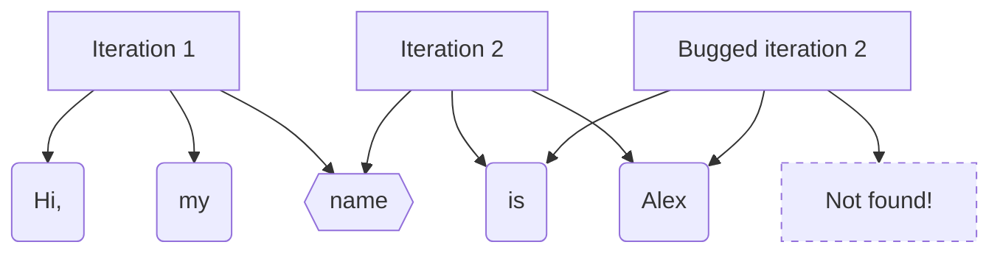

# Special parameters

* Memory
* Multplier
* Threshold

**All this parameters are optional!**, if you don't set them, they'll be set to the recommended values. If you don't know what you're doing, I recommend you to just use `None` and flow with the default.

## Memory

Every phrase is made up from words. We make a phrase from adding sequences of words together. Well, the `memory` parameter is used to define how many words we take into account into analyzing a phrase.

The functions that takes this parameter take into account that maybe the length of the phrase divided by the number of words in the phrase is not an integer. So this functions will take into account until the last words, and then scan the words between the length of the phrase minus the memory and the length of the word.



###### Honestly, I just wanted to show you how it works, and this graph.

<!-- ## Multiplier

None of the functions in this library really manipulates the words, every single string in the dataset is "translated" to a number, that number is its value. In other words, a word is the sum of its letters multiplied by a multiplier. The special parameter multiplier is **that** multiplier.

When electing a word it checks for its relations with other words, so if that relation is greater than the threshold, it will be elected. So, if the multiplier is a big number (more than 20 isn't recommended), the word "spaghetti" and the word "spagetti" will seem very different, even if they are the same word (typo).

It works the other way around, if the multiplier is a small number (less than 5 isn't recommended) very different words will seem similar, even if they are very different.

**Example:**

ADD A - TO UNCOMMENT

```mermaid
graph LR
A(450)
B(330)

X{{x5}}

C(2250)
D(1650)

Y{{"1,36 > Threshold, not elected!"}}

A->X;
B->X;

X->|450 x 3|C;
X->|330 x 3|D;

C->|"Divided by 1650"|Y;
D->|"Divided by 2250"|Y;

%% Second graph %%

X2{{x20}}

C2(9000)
D2(6600)

A->X2;
B->X2;

X2->|450 x 20|C2;
X2->|330 x 20|D2;

C2->|"Divided by 6600"|Y;
D2->|"Divided by 9000"|Y;
``` -->

## Threshold

As you know, we divide two values to find their relations. Well, that relation is then checked against the threshold, if it doesn't passes the threshold, the word is not elected.

This is the operation to determine if a word is elected. As you can see, if the threshold is too low (less than 0.1 is not recommended), the word "spaghetti" and the word "spagetti" will not be relationated. But if the threshold is too high (more than 0.3 is not recommended), a lot of words, even if they are very different, will be relationated and the final result will not have sense.